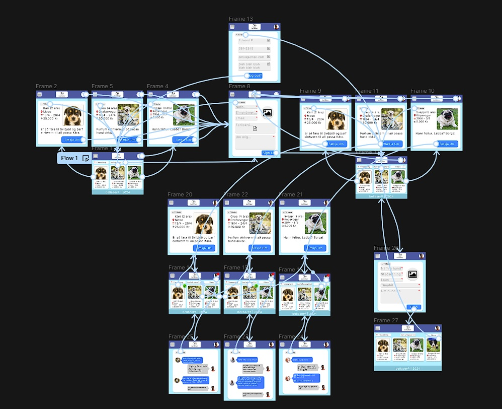
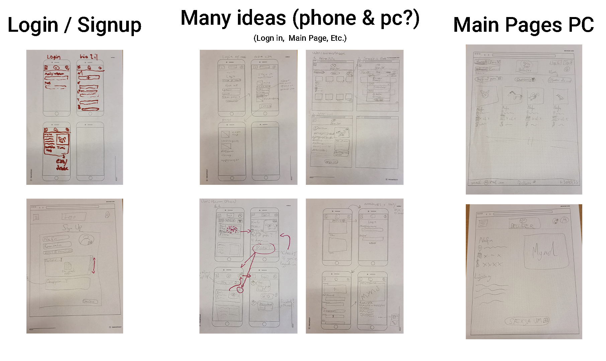

# Vefforritun-2-hopur-2-Lokaverkefni

Deilihagkerfi fyrir gæludýraþjonustur, svipað eins og airbnb eða uber.  Það eru tveir markhópur semsagt kaupendur gæludýraeigendur og seljendur þjónustufulltrúi. Þjónustufulltrúi eru fagmenn gæludýra, námsmenn, fjölskyldur og aðrir

Nafn á appi: Bellaser “Um gæludýrirð þitt” 

Hvað er þetta?:
App sem leyfir þér að setja inn dýr og óska eftir pössun eða að fara í göngutúr gegn greiðslu. 
Svo er fólk sem býður sig fram til þess að hugsa um dýrin.

---
### User Stories:
1. **Hundagönguþjónusta þarf:**
    Guðmundur ættleiddi nýlega hund sem heitir Tóti. Með langan vinnutíma hefur Guðmundur þó áhyggjur af því að Tóti sé ekki að hreyfa sig nægilega. Hann ákveður að prófa Bellaser og finnur fljótt hundagöngumann á staðnum. Nú getur Guðmundur einbeitt sér að starfi sínu vitandi að Tóti er að fá daglegu göngutúra sem hann þarf til að vera hamingjusamur og heilbrigður.

2. **Beiðni um hundapössun:**
    Sigríður og Jónas, ungt par, eru að skipuleggja helgarferð en vilja ekki skilja hundinn sinn Bellu eftir eina heima. Þeir nota Bellaser til að finna gæludýravörð. Bella nýtur smáfrísins með vinalega gæludýragæslunni og Sigríður og Jónas geta slakað á vitandi að Bella er í góðum höndum á meðan þau eru í burtu.

3. **Unglingur fær aukapening:**
    Þórður, unglingur sem vill vinna sér inn aukapening í sumarfríinu, ákveður að skrá sig sem hundagöngumaður á Bellaser. Hann býr til einfaldan prófíl sem undirstrikar ást sína á hundum og framboð hans yfir sumarmánuðina. Þórður skráir sig því og sendir gæludýraeigendum beiðnir um að ganga með hundana sína. Hann nýtur þess að eyða tíma utandyra með nýju loðnu vinum sínum og afla tekna við að gera eitthvað sem hann elskar.

4. **Að vera gæludýravörð:**
    Anna ákveður að bjóða þjónustu sína sem gæludýravörður á Bellaser. Hún skapar velkominn prófíl og laðar fljótt að sér gæludýraeigendur sem leita að umhyggjusömum og áreiðanlegum fóstru. Anna nýtur þess að hýsa hunda á heimili sínu, veita þeim ást, athygli og nóg af göngutúrum. Í gegnum Bellaser fyllir Anna dagana sína ekki aðeins af gleðinni við að sjá um gæludýr heldur aflar hún sér líka smá aukatekna til að bæta við eftirlaunin.
---
### Figma:
Figma YouTube sýning: https://youtu.be/9gCfWpOVHu4

Figma page: https://www.figma.com/proto/fHvDNlb2XIuve4NpSjSykb/Bellaser?type=design&node-id=12-8&t=p98RlXWyEjtaXzxu-0&scaling=min-zoom&page-id=0%3A1&starting-point-node-id=12%3A8

Figma BTS: https://www.figma.com/file/fHvDNlb2XIuve4NpSjSykb/Bellaser?type=design&node-id=0%3A1&mode=design&t=p98RlXWyEjtaXzxu-1

---
### Wireflows:

